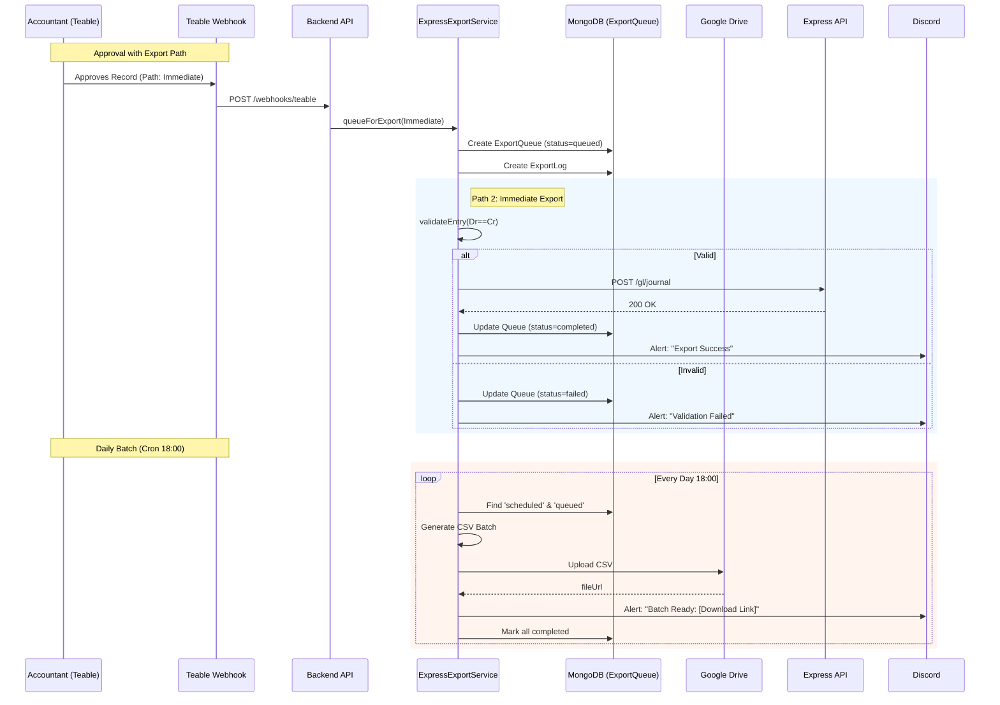

# Architecture Analysis: Phase 3C (Smart Auto-Export)

**Generated**: 2026-01-17
**Status**: Analysis Complete

---

## 🔍 System State Analysis

### 1. Teable Integration
- **Current State**: 
  - `TeableClient.ts` exists for API calls (create/update records).
  - **Webhook Handler**: `src/modules/teable/routes.ts` is currently **EMPTY**.
  - **Payload**: No existing schema defined in code.
  - **Gap**: Need to implement the webhook endpoint `POST /webhooks/teable` from scratch to handle `exportPath` field.

### 2. Medici Integration (Accounting)
- **Current State**:
  - `JournalEntry` model (Mongoose) maps to `medici` book structure.
  - `AccountingRepository` likely encapsulates `medici` calls.
  - **Validation**: Double-entry (Dr == Cr) needs to be enforced before export.
  - **Gap**: `ExpressExportService` needs to query `JournalEntry` and validate `medici` transactions (Dr/Cr balance) exactly as Phase 3C requires.

### 3. Google Drive Service
- **Current State**:
  - `files/routes.ts` is **EMPTY**.
  - `OCRService` and `Receipt` model reference `driveFileId`.
  - **Gap**: **CRITICAL**. No dedicated `GoogleDriveService.ts` found in `src/services` or `src/modules/files`. 
  - **Action**: Must create `GoogleDriveService` (wrapper around `googleapis` or REST API) as part of Phase 3C (Task 2.1 dependency).

### 4. Discord Service
- **Current State**: ✅ **READY**
- **Location**: `src/loaders/logger.ts` exports `sendCriticalAlert`, `sendInfoLog`, `sendMLUpdate`.
- **Usage**: ready to be imported and used in `ExpressExportService`.

---

## 🏗️ Proposed Architecture (Phase 3C)

### New Modules & Locations

| Component | Proposed Path | Description |
|:----------|:--------------|:------------|
| **ExportQueue Model** | `src/modules/export/models/ExportQueue.ts` | Tracks export requests & status |
| **ExportLog Model** | `src/modules/export/models/ExportLog.ts` | Audit trail for debugging |
| **ExpressExportService** | `src/modules/export/ExpressExportService.ts` | Core logic (3 paths, validations) |
| **ExportController** | `src/modules/export/ExportController.ts` | API endpoints (`/queue`, `/metrics`) |
| **GoogleDriveService** | `src/modules/files/GoogleDriveService.ts` | **NEW**: File upload/auth logic |
| **DailyExportJob** | `src/jobs/DailyExportJob.ts` | Cron job for 18:00 batch |
| **Teable Webhook** | `src/modules/teable/controllers/TeableWebhookController.ts` | Handles incoming approval events |

### 📊 Interaction Diagram

---

## ⚠️ Critical Dependencies Missing

1.  **GoogleDriveService**: Needs implementation (using service account credentials from env).
2.  **Teable Webhook Handler**: Needs implementation from scratch.

## ✅ Readiness
- **Database**: MongoDB ready.
- **Logging**: Discord Logger ready.
- **Config**: Env vars for Drive/Teable exist.

**Recommendation**: Proceed to Task 0.2 (Branch Creation), but acknowledge `GoogleDriveService` needs to be added to **Task 2.1** scope.
